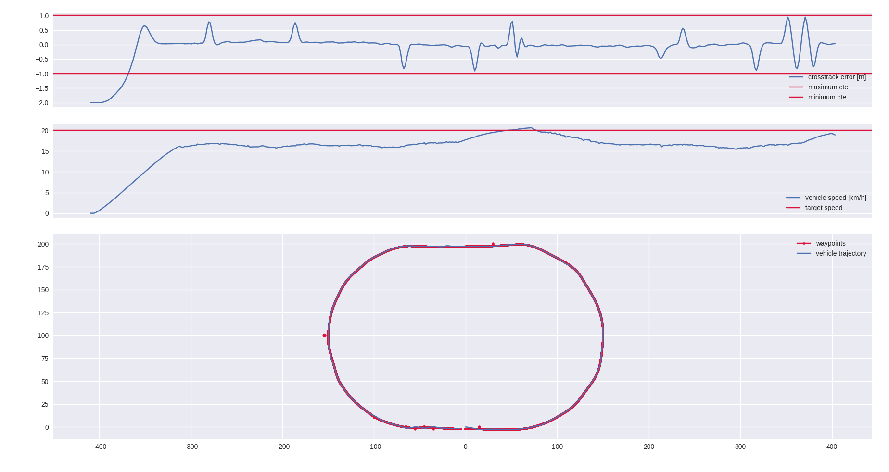

# Ground vehicles navigation

<a href="results"></a>
See full [video](./mpc_demo.mp4)

## Abstract

The Goal of this assignment was to create a model predictive controller to use with the [POLARIS_GEM_e2 simulator](https://gitlab.engr.illinois.edu/gemillins/POLARIS_GEM_e2), which given a specific path, is able to follow it with an accuracy of at least 1m while able to avoid obstacles.

In this repository I propose my solution and showcase the results.

## Project Structure

The **src** directory contains the following ros packages:
* `mpc_control` -> ROS package containing the actual MPC implementation.
  * `src/mpc_node.cpp` -> Actual control node, built as a ROS wrapper of a optimization problem modelled with the [CasADi](https://web.casadi.org/docs/) framework.

* `mpc_gazebo` -> ROS package containing all the necessary to run the MPC trial on the POLARIS_GEM vehicle and evaluate the results.
  * `scripts/mpc_evaluator.py` -> A script that permorms the MPC evaluation. This script starts a ROS node that publishes the *Path* and *Obstacles* for the controller and logs its position over time to evaluate the error metrics.
  * `scripts/obstacle_spawner.py` -> A helper script to spawn gazebo entities from a template. 
  * `launch/mpc_demo.launch` -> Main launchfile that brings up the simulation environment, the control node and the evaluator script that performs the trial.
  * `data/obstacles.csv` -> Obstacles used in the evaluation, with the form (x_pos, y_pos, radius) w.r.t **world**.
  * `data/gps-waypoints.csv` -> Waypoints used in the evaluation, with the form (lat,lon) 

The **docker** directory contains the dockerfile with all the dependencies in order to run the demo. See [Build with Docker] for more details.

## Controller Architecture

The controller implements the following MPC problem, adapted from [*1*]:

$$
\begin{aligned}
min_{x_1,\dots,x_{N+1}, u_1, \dots, u_{N+1}} \quad & \sum_{k=1}^{N+1} ({x_k - xref_k})^T Q ({x_k- xref_k}) + \sum_{k=2}^{N} ({u_k - u_{k-1} })^T R ({u_k- u_{k-1}}) \sum_{k=1}^{N}\sum_{j=1}^{O} D \log(1 + e^{ -d(x_k, o_k)}) + S(u_k, u_{k-1}) \\
\textrm{s.t.} \quad & x_{k+1}=f(x_k,u_k) \\
\quad & u_{min} \leq u_k \leq u_{max}    \\
\quad & x_{min} \leq x_k \leq x_{max}    \\
\quad & x_1 == x_{start}    \\
\end{aligned}
$$

Where:
* $x_k$ is the state of the vehicle {x,y,heading,speed}
* $u_k$ is the control input to the vehicle {acceleration,steer}
* $Q$ tracking error weight matrix
* $R$ control rate weight matrix
* $D$ obstacle proximity weight, *where d(x_k,o_j) is the signed distance of the vehicle at time k from obstacle j*
* $S$ is the control rate slack cost, this makes *jerk* and *slew* soft-constrains.
* $f$ is the function of our model

The vehicle is modelled in the controller the *bicycle model* kinematic equations and these kinematic constrains:
| Wheel Base | Width | Min/Max Steer | Min/Max Slew | Min/Max Speed | Min/Max Acc | Min/Max Jerk |
| --- | --- | --- | --- | --- | --- |--- |
| 1.75 m    | 1.2 m    | [-0.61,0.61] rad    | [-0.5,0.5] rad/s    | [0,10] m/s    | [-3,3] m/s^2   |  [-1.5,1.5] m/s^3  |

## Results

The final controller has been tuned with this set of parameters:

| Param | Value |
| --- | --- |
| `control_horizon_len` | 20 |
| `time_step` | 0.1 |
| `min_obstacle_margin ` | 0.25 |
| `x_pos_error_weight` | 1.0 |
| `y_pos_error_weight` | 1.0 |
| `heading_pos_error_weight` | 0.1 |
| `speed_error_weight` | 1.0 |
| `acceleration_rate_weight` | 10.0 |
| `steer_rate_weight` | 100.0 |
| `obstacle_distance_weight` | 7.0 |

The parameters were tuned to satisfy the requirement of **keeping the tracking error within 1m** while mantaining a satisfactory obstacle avoidance performance and a smooth, oscillation-free trajectory.

<a href="results"></a>

### Build with Docker

From this repository root directory:
```bash
docker build -t mpc-demo -f docker/Dockerfile .
```

Run it:
```bash
xhost +local:
docker run -it --net=host --ipc=host --privileged \
    --env="DISPLAY" \
    --env="QT_X11_NO_MITSHM=1" \
    --volume="/tmp/.X11-unix:/tmp/.X11-unix:rw" \
    --volume="${XAUTHORITY}:/root/.Xauthority" \
    mpc-demo:latest \
    bash -c "roslaunch mpc_gazebo mpc_demo.launch"
```

### References
* [1][MPC Berkley - genesis path follower](https://github.com/MPC-Berkeley/genesis_path_follower/tree/master)
